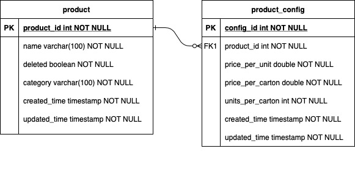

# 99X Price Engine
*Author: Hafeez Marzuk*

### Design flow

#### Sequential flow diagram

#### Entity relationship diagram

### Installation guide

#### Pre-requisites

- Mysql 5+
- Java 8+
- Gradle 6+

#### Build the project

1. Invoke the command mentioned in [here](#database-migration) to configure the database
2. Build the project with the command `gradle clean build`
3. Run the spring boot application `gradle bootRun`

### Testing

- Run junit test cases with the command `gradle test`
- Regression test postman project is available in `/nnx-price-engine/postman/99X-Price-Engine.postman_collection.json` location 

### Database migration
	
	mysql -h localhost -u root --password= -e 'source src/main/resources/db/nnx_price_engine_schema.sql'
	
### API documentation url

	http://localhost:8050/nnxpriceengine/swagger-ui.html
	
